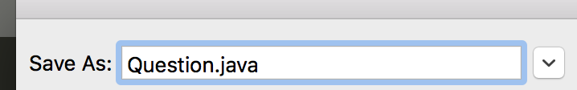

# INTRODUCTION TO COMPUTER SCIENCE

# CAPSTONE PROJECT: DAY TWO/THREE

# OBJECTIVE

1. Continue putting together our projects.
2. We will create a helper class to create our Questions.
3. We will create the logic that checks if the user's input is correct.

# Question.java

1. Inside of our folders we will create a new file called `Question.java`. This file will be very short and simple, it's purpose is to create objects that represent each of our questions.
2. Each of our question objects has a question (with choices) and an answer.
3. Let's open Sublime Text
   - Go to `File`
   - Click `Save As...`
   * Click the **arrow** pointing downwards on the right
   - 
   * Click `Desktop`
   * 
   * Now find your folder, then click **Save**.
4. Below is the code you will insert into `Question.java`, once this is done **Save** your work then open up `TriviaGame.java`.

```java
public class Question {

  String prompt;
  String answer;

  public Question(String prompt, String answer){
    this.prompt = prompt;
    this.answer = answer;
  }
}
```

# TriviaGame.java (part 1)

1. At this point, we have our questions created and stored in `String`'s that we named `q1, q2, q3, etc...`.
2. Underneath our variables we will insert:
   - We will be using an `Array` to store our questions.
   - An `Array` is an example of a `datatype` we didn't learn this quarter.
   - We are giving our array a type of `Question`, because we will be storing our questions in this array, which directly relates to `Question.java`.

```java
    Question [] questions = {
      new Question(q1, "a"),
      new Question(q2, "b"),
      new Question(q3, "c"),
      new Question(q4, "a"),
      new Question(q5, "b"),
      new Question(q6, "b")
    };

    startGame(questions);
```

3. Notice that `new Question(____, ____)` takes in **2 parameters**, the first parameter is the question itself (that we declared above) and the second parameter is the answer to that question.
4. After we declare our array we are starting our game by running the startGame method, by doing `startGame(questions)`.

# TriviaGame.java (part 2)

1. We will now create a new method in `TriviaGame.java`. Let's insert this new method after the `welcome` method we created. Let's find the closing `}` for the `welcome` method and insert the below code.
   - This method is responsible for checking for correct answers and once the game is completed we will give our user a score.

```java
  public static void startGame(Question [] questions){
    int score = 0;
    Scanner keyboardInput = new Scanner(System.in);

    for(int i = 0; i < questions.length; i++){
      System.out.println("QUESTION #" + (i+1) + ":");
      System.out.println("_________________________");
      System.out.println(questions[i].prompt);
      System.out.println();
      System.out.print("Your Answer => ");
      String answer = keyboardInput.nextLine();
      System.out.println();
      if(answer.equals(questions[i].answer)){
        score++;
      } else {
        score--;
      }
    }

    System.out.println("Final Score: " + score + " points.");
    System.out.println("________________________");
  }
```

2. Remeber, we are using input from our keyboard, therefore at the **VERY** top of `TriviaGame.java` on line 1, we have to write `import java.util.Scanner;`.

# HOMEWORK

1. Makeup HW, if there is any Homework you missed, please submit it.

# HOMEWORK SUBMISSION

## [How do I submit my homework assignment?](https://github.com/ECS-CS/2018-2019/blob/master/6-8th/HomeworkSubmission.md)

# EXTRA HELP

## [Need help with your Homework? or Quiz/Test preparation?](https://github.com/ECS-CS/2018-2019/blob/master/6-8th/ExtraHelp.md)
